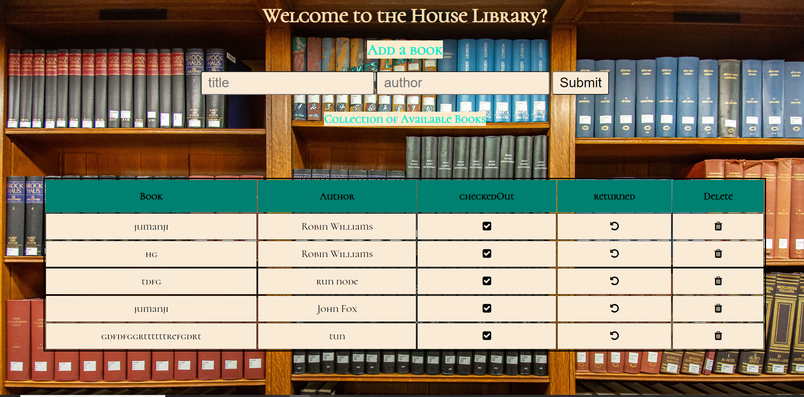

# House library

House Moses has a library app that keeps track on the books that have been borrowed and returned to the library. App is built on express

## How It's Made
Tech used: Node.JS, MongoDB, Express.JS, EJS & JavaScript

I used html tables to structure the general layout of the cells as seen in the image above. Once the book title and author are entered, the table appends the checkedout, returned and delete icons to the row of books. This is saved to the database immediately the post request is made.
This is a full stack web app using express.

### Optimization  
I decided to use Express on this app in order to write less but more readable code

### Lessons Learned 
I enjoyed working on this project, I didn't have to append HTML elements through my JavaScript but instead used the EJS tags to dynamically render the tables which was really fun 
